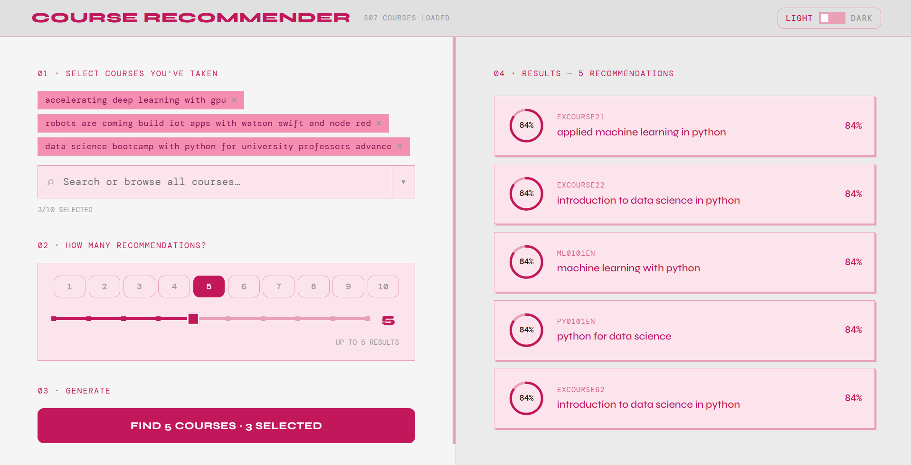
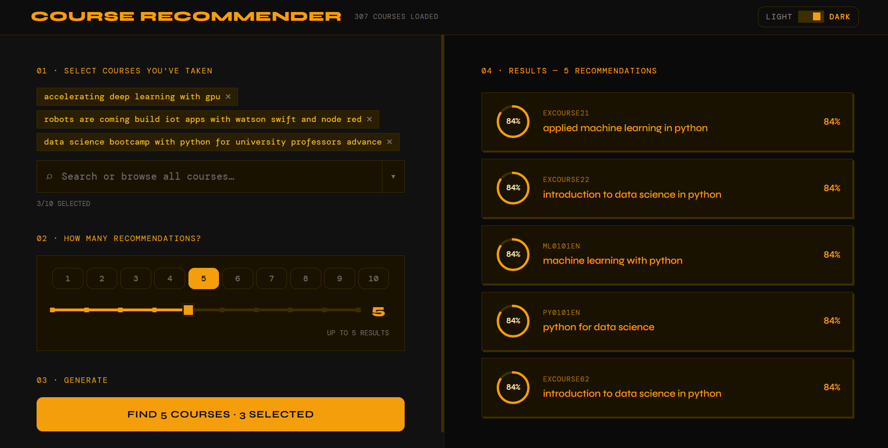

# Course Recommender

A machine learning web app that recommends courses based on ones you've already taken. Built with a FastAPI backend using cosine similarity on course genre vectors, and a React frontend with light/dark mode.

---

## Screenshots




---

## How It Works

The recommender builds a user profile by averaging the genre vectors of your selected courses, then ranks all other courses by cosine similarity to that profile. The more courses you select, the more personalized the results.

---

## Tech Stack

**Backend**
- Python, FastAPI, Uvicorn
- scikit-learn (cosine similarity, L2 normalization)
- pandas, scipy (sparse matrices)

**Frontend**
- React (Vite)
- Vanilla CSS-in-JS (no external UI library)

---

## Project Structure

```
course-recommender/
├── app.py                 # FastAPI backend
├── course_genre.csv       # Course dataset (307 courses, genre vectors)
├── requirements.txt       # Python dependencies
├── screenshots/           # App screenshots
│   ├── light-mode.png
│   └── dark-mode.png
├── course-ui/
│   ├── src/
│   │   └── App.jsx        # React frontend (single file)
│   ├── package.json       # Node dependencies (Vite + React)
│   └── index.html         # Vite HTML entry point
├── README.md
└── .gitignore
```

---

## Setup & Running

### 1. Clone the repo

```bash
git clone https://github.com/YOUR_USERNAME/course-recommender.git
cd course-recommender
```

### 2. Start the backend

```bash
pip install -r requirements.txt
python app.py
```

Backend runs at `http://127.0.0.1:8000`

### 3. Start the frontend

```bash
cd course-ui
npm install
npm run dev
```

Frontend runs at `http://localhost:5173`

Both servers must be running simultaneously. Open `http://localhost:5173` in your browser.

---

## Usage

1. **Select courses** — search by title or ID, or browse the full list using the dropdown. Up to 10 courses can be selected at once.
2. **Choose how many recommendations** — use the number buttons or drag the slider (1–10).
3. **Hit Generate** — results appear on the right panel with a similarity percentage score.
4. **Toggle dark/light mode** — button in the top-right corner.

---

## API Endpoints

| Method | Endpoint | Description |
|--------|----------|-------------|
| GET | `/courses` | Returns all course IDs and titles |
| POST | `/recommend?n=5` | Accepts a JSON list of course IDs, returns top n recommendations |

**Example request:**
```bash
curl -X POST "http://127.0.0.1:8000/recommend?n=5" \
  -H "Content-Type: application/json" \
  -d '["ML0101EN", "DL0101EN"]'
```

**Example response:**
```json
{
  "recommendations": [
    {"course_id": "ML0201EN", "title": "Machine Learning with Python", "score": 0.94},
    ...
  ]
}
```

---

## Dataset

`course_genre.csv` contains 307 courses sourced from the [IBM Machine Learning with Python course](https://www.coursera.org/learn/machine-learning-with-python) on Coursera, provided by IBM. Each row has a `COURSE_ID`, `TITLE`, and binary genre columns indicating which topics the course covers (e.g., Machine Learning, Python, Data Analysis, etc.).

> **Credit:** Course dataset provided by IBM via Coursera.
